```mermaid
graph LR
    subgraph UserLayer["User Layer (Rate Limited)"]
        A["User Authentication (MFA + IP Verification)"] --> B["Application Request"]
        Z["API Key Rotation Scheduler"]
    end
    
    subgraph LoadBalancer["Load Balancer Layer"]
        B --> WAF["Web Application Firewall"]
        WAF --> RateLimit["Rate Limiter"]
    end
    
    subgraph AppServer["App Server (Memory Protected)"]
        RateLimit --> C["Retrieve Encrypted User Key"]
        C -- Encrypted User Key --> D["Retrieve Encrypted KEK"]
        
        E -- Decrypted KEK --> F["Decrypt User Key"]
        F -- Decrypted User Key --> G["Retrieve Encrypted DEK"]
        
        G -- Encrypted DEK --> H["Decrypt DEK"]
        H -- Decrypted DEK --> I["Retrieve Encrypted Secret"]
        
        I -- Encrypted Secret --> J["Decrypt Secret (Secure Memory)"]
        J -- "Decrypted Secret (Auto-wipe)" --> K["Return Secret to User"]
        
        Z --> RotationService["Key Rotation Service"]
        RotationService --> C
    end

    subgraph Database["Database Layer (Encrypted at Rest)"]
        C --> DB1["Encrypted User Keys"]
        D --> DB2["Encrypted KEKs"]
        G --> DB3["Encrypted DEKs"]
        I --> DB4["Encrypted Secrets + Versions"]
    end

    subgraph HSM["HSM Cluster"]
        D -- "Encrypted KEK" --> E["Decrypt KEK (using Master Key)"]
    end

    subgraph AuditLog["Security Monitoring"]
        B --> L["Log Access Event"]
        L --> M["Blockchain (Immutable Audit)"]
        L --> SIEM["SIEM System"]
        
        N["Intrusion Detection"] --> SIEM
        O["Behavior Analytics"] --> SIEM
    end

    subgraph Backup["Backup & Recovery"]
        DB1 --> P["Encrypted Backup"]
        DB2 --> P
        DB3 --> P
        DB4 --> P
    end

    style WAF fill:#f96,stroke:#333,stroke-width:2px
    style RateLimit fill:#f96,stroke:#333,stroke-width:2px
    style HSM fill:#ccf,stroke:#333,stroke-width:2px
    style SIEM fill:#9f6,stroke:#333,stroke-width:2px
    
    classDef encrypted fill:#e9f,stroke:#333,stroke-width:2px
    class DB1,DB2,DB3,DB4,P encrypted 
```

[![](https://mermaid.ink/img/pako:eNqdVu9P6zYU_VcsP2kqWkFt01CSD5NaUqCPslVU25NY98EkbmuRxJnt8F6G-N93bSeP_HqIrVIa2zrn-Pj6-jovOOQRxT4-CJId0fp-J3Ypgp_MH-3Q75KKNSmo-HOHdRuZDhrcE0XRmiVM0ehkh_-qiPo3r7DzXB1pqlhIFOMpGtxdzdHPaLVBf1DB9uWwZqPT01_QAmjzLIsr-D39O6dStcQfNGqzQre0QPdcWeg2PNIoj6mogWkaVc3OqtacRAsSkzQ0C9NdVPXtCluzLozDL_MrQH-hj6ju84oJ-pXEcYsCYEPSkTKBAmotah-1CjNtqXg2PqGNbAdiSRMuCrQRXNGwZxO-T2tMXOrJqRKMPlO0TENRZMAxu6sj2eJeAqcHZZSCfqXb5W1LpN5easGA1sBGS0ezHP2Rlasms2Hlut9K8K6V6-bagtLKTc1KV-Cm6aIirfoNbAFI1TseVk0PFm8UP9dslMMDeOeCIrvh7W3-rKW-c97EBnD2-OlXllFgGOlbazYXaYVR3MTzHaMPNoPLY6ZTj4UUdJqHzw63869JslnYSvhOsgdEkUci9RRVsyo4b-EiCkqDVCc9SQvpuRgDuZu7soUOSvSkgYbEbAOvS6DTAAZd4KoEThtAG2oJZQ9qnoR4yO6574ThZnsHIvCPLuNcqs4WBXbTW6fPzL-sJZA-ZoNcsvSA7oiW0YE4-cD88zxias0PoGWSj6kC3fGUKS5ArLc0rk0ZPaB5GFIp0fIZ6n4LuDZAvbJFzMOn8EgY3AmrJMlhp2NqZz3pJW1XS83TL7QtYCnJO0n7KyBXqRK5DjecWl0foVVdM1qkDv9NG6JH8sw43FgpiQu4sGQf-kfhWpDwKc-0jGmgnyA_Qw5Vul3MIDmN6KaRIpbVgU4stDno9A1Om4Ntm6qA4OrbaM_i2P-0986HUgn-RP1PjuOUbSgVkTr6k-xbk_d2jfwftk5hywvD_X_gmY22RG__sQmrdxgTKQO6hzBUAbZC1PuYAyOgt2oIewCPA890uHnTw0OcUJEQFsGH04sm7TB85yRQAX1oRkQ87fAufQUcgSK8LdIQ-5COdIgFzw9H7O9JLKGXZxFEN2AE0iipIBlJHzivd7H_gr9hf-qdzcbuZDbyvPOR58zcIS6wP_bGZ-7FyLlwnNFodjGeuK9D_I8RGJ25Y3c6dV13MpqMvOns_PVf654LVA?type=png)](https://mermaid.live/edit#pako:eNqdVu9P6zYU_VcsP2kqWkFt01CSD5NaUqCPslVU25NY98EkbmuRxJnt8F6G-N93bSeP_HqIrVIa2zrn-Pj6-jovOOQRxT4-CJId0fp-J3Ypgp_MH-3Q75KKNSmo-HOHdRuZDhrcE0XRmiVM0ehkh_-qiPo3r7DzXB1pqlhIFOMpGtxdzdHPaLVBf1DB9uWwZqPT01_QAmjzLIsr-D39O6dStcQfNGqzQre0QPdcWeg2PNIoj6mogWkaVc3OqtacRAsSkzQ0C9NdVPXtCluzLozDL_MrQH-hj6ju84oJ-pXEcYsCYEPSkTKBAmotah-1CjNtqXg2PqGNbAdiSRMuCrQRXNGwZxO-T2tMXOrJqRKMPlO0TENRZMAxu6sj2eJeAqcHZZSCfqXb5W1LpN5easGA1sBGS0ezHP2Rlasms2Hlut9K8K6V6-bagtLKTc1KV-Cm6aIirfoNbAFI1TseVk0PFm8UP9dslMMDeOeCIrvh7W3-rKW-c97EBnD2-OlXllFgGOlbazYXaYVR3MTzHaMPNoPLY6ZTj4UUdJqHzw63869JslnYSvhOsgdEkUci9RRVsyo4b-EiCkqDVCc9SQvpuRgDuZu7soUOSvSkgYbEbAOvS6DTAAZd4KoEThtAG2oJZQ9qnoR4yO6574ThZnsHIvCPLuNcqs4WBXbTW6fPzL-sJZA-ZoNcsvSA7oiW0YE4-cD88zxias0PoGWSj6kC3fGUKS5ArLc0rk0ZPaB5GFIp0fIZ6n4LuDZAvbJFzMOn8EgY3AmrJMlhp2NqZz3pJW1XS83TL7QtYCnJO0n7KyBXqRK5DjecWl0foVVdM1qkDv9NG6JH8sw43FgpiQu4sGQf-kfhWpDwKc-0jGmgnyA_Qw5Vul3MIDmN6KaRIpbVgU4stDno9A1Om4Ntm6qA4OrbaM_i2P-0986HUgn-RP1PjuOUbSgVkTr6k-xbk_d2jfwftk5hywvD_X_gmY22RG__sQmrdxgTKQO6hzBUAbZC1PuYAyOgt2oIewCPA890uHnTw0OcUJEQFsGH04sm7TB85yRQAX1oRkQ87fAufQUcgSK8LdIQ-5COdIgFzw9H7O9JLKGXZxFEN2AE0iipIBlJHzivd7H_gr9hf-qdzcbuZDbyvPOR58zcIS6wP_bGZ-7FyLlwnNFodjGeuK9D_I8RGJ25Y3c6dV13MpqMvOns_PVf654LVA)

